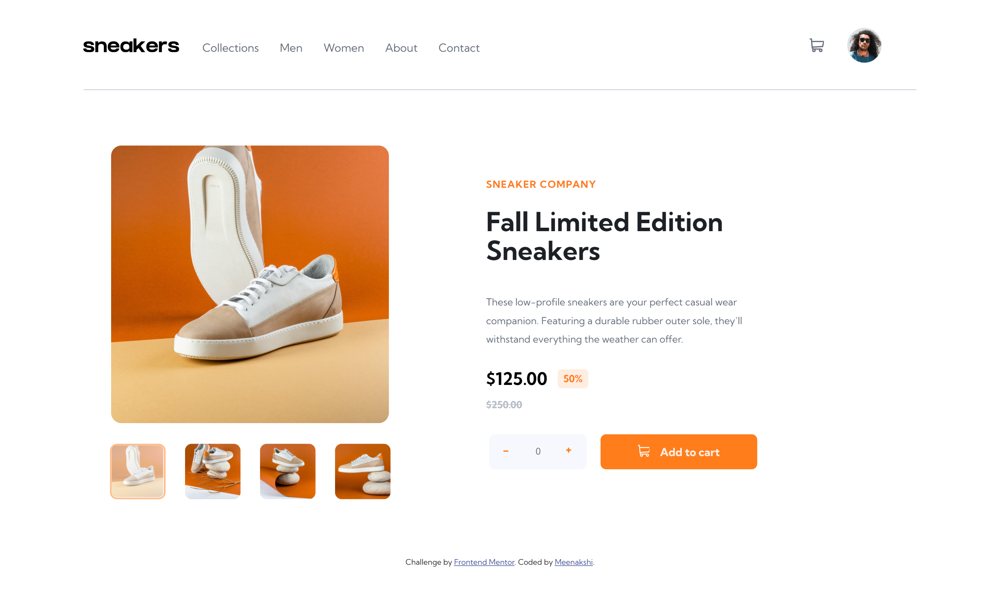
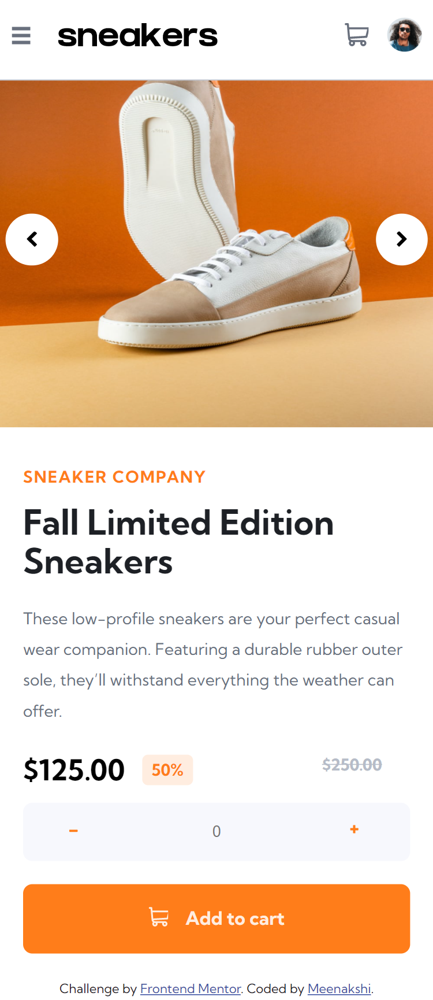

# Frontend Mentor - E-commerce product page solution

This is a solution to the [E-commerce product page challenge on Frontend Mentor](https://www.frontendmentor.io/challenges/ecommerce-product-page-UPsZ9MJp6). Frontend Mentor challenges help you improve your coding skills by building realistic projects.

## Table of contents

- [Overview](#overview)
  - [The challenge](#the-challenge)
  - [Screenshot](#screenshot)
  - [Links](#links)
- [My process](#my-process)
  - [Built with](#built-with)
  - [What I learned](#what-i-learned)
- [Author](#author)

## Overview

### The challenge

Users should be able to:

- View the optimal layout for the site depending on their device's screen size
- See hover states for all interactive elements on the page
- Open a lightbox gallery by clicking on the large product image
- Switch the large product image by clicking on the small thumbnail images
- Add items to the cart
- View the cart and remove items from it

### Screenshot





### Links

- Solution URL: [Solution URL here](https://github.com/Memeena/ecommerce-product-page-main)
- Live Site URL: [Live site URL here](https://memeena.github.io/ecommerce-product-page-main/)

## My process

### Built with

- Semantic HTML5 markup
- CSS custom properties
- Flexbox
- CSS Grid
- Desktop-first workflow

### What I learned

This challenge helped me improve the following concepts.

- CSS Flexbox and GRID
- Using sprite.svg file for svg icons
- Hamburger menu for mobile
- Overlay features when the modal is opened
- Sliding the images in the light box using JS
- Resuing the functions by changing the scope
- Getting the CSS values in JS by using getComputedStyle method
- Inserting the HTML tags using insertAdjacentHTML in JS
- Getting data by using the lastChild property from the parent node in JS
- Adding animations using transform and transition for the click of buttons

Code snippets I am proud about, see below:

```js
basketDetails.lastChild.addEventListener("click", emptyCart);
```

## Author

- Frontend Mentor - [@Memeena](https://www.frontendmentor.io/profile/Memeena)
- Twitter - [@MeKrish18](https://www.twitter.com/MeKrish18)
